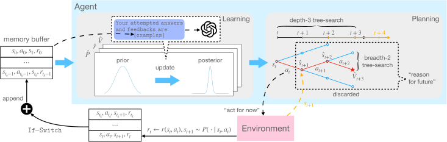

# Reason for Future, Act for Now: A Principled Framework for Autonomous LLM Agents with Provable Sample Efficiency

Code for [Reason for Future, Act for Now: A Principled Framework for Autonomous LLM Agents with Provable Sample Efficiency](https://arxiv.org/abs/2309.17382), International Conference on Machine Learning (ICML), 2024.

Project page: https://agentification.github.io/RAFA.

Authors: [Zhihan Liu](https://scholar.google.com/citations?user=uEl_TtkAAAAJ&hl=en)&ast;, [Hao Hu](http://mousehu.cn)&ast;, [Shenao Zhang](https://shenao-zhang.github.io)&ast;, [Hongyi Guo](https://scholar.google.com/citations?user=bzPCv_8AAAAJ&hl=en), [Shuqi Ke](https://openreview.net/profile?id=~Shuqi_Ke1), [Boyi Liu](https://scholar.google.com/citations?user=1G8RH_YAAAAJ&hl=en), [Zhaoran Wang](https://zhaoranwang.github.io) (&ast; indicates equal contribution)



Please follow the instructions in the respective directories to reproduce our results in the four benchmarks: 
* [Game of 24](https://github.com/agentification/RAFA_code/tree/main/Game24)
* [ALFWorld](https://github.com/agentification/RAFA_code/tree/main/ALFWorld)
* [BlocksWorld](https://github.com/agentification/RAFA_code/tree/main/BlocksWorld)
* [Tic-Tac-Toe](https://github.com/agentification/RAFA_code/tree/main/Tic-Tac-Toe)

---
# Game of 24
## Environment setup
- Set `OPENAI_API_KEY` environment variable to your OpenAI API key:
```bash
export OPENAI_API_KEY=<your key>
```
## Run the code

### Experiment replication

```
python run.py --backend gpt-4 --task game24 --task_file_path 24.csv --task_start_index 900 --task_end_index 1000 --prompt_sample standard --n_generate_sample 10 --method_generate propose --method_evaluate value --method_select greedy --n_select_sample 1 --n_evaluate_sample 3 --feedback
```

### Params for different method

- baseline ToT method (b=1, b=2)

```
python run.py --backend gpt-4 --task game24 --task_file_path 24.csv --task_start_index 900 --task_end_index 1000 --prompt_sample standard --n_generate_sample 10 --method_generate propose --method_evaluate value --method_select greedy --n_select_sample 1 --n_evaluate_sample 3 --planning tot
```

```
python run.py --backend gpt-4 --task game24 --task_file_path 24.csv --task_start_index 900 --task_end_index 1000 --prompt_sample standard --n_generate_sample 10 --method_generate propose --method_evaluate value --method_select greedy --n_select_sample 2 --n_evaluate_sample 3 --planning tot
```

- baseline Reflexion method

```
python run.py --backend gpt-4 --task game24 --task_file_path 24.csv --task_start_index 900 --task_end_index 1000 --prompt_sample standard --n_generate_sample 10 --method_generate propose --method_evaluate value --method_select greedy --n_select_sample 1 --n_evaluate_sample 3 --planning naive --feedback
```

- RAFA (b=1, b=2)

```
python run.py --backend gpt-4 --task game24 --task_file_path 24.csv --task_start_index 900 --task_end_index 1000 --prompt_sample standard --n_generate_sample 10 --method_generate propose --method_evaluate value --method_select greedy --n_select_sample 1 --n_evaluate_sample 3 --planning tot --feedback
```

```
python run.py --backend gpt-4 --task game24 --task_file_path 24.csv --task_start_index 900 --task_end_index 1000 --prompt_sample standard --n_generate_sample 10 --method_generate propose --method_evaluate value --method_select greedy --n_select_sample 2 --n_evaluate_sample 3 --planning tot --feedback
```


### GPT 3.5
To run gpt-3.5-turbo, just replace `--backend gpt-4` with `--backend gpt-3.5-turbo`. You can use `--backend gpt-3.5-turbo-16k` to avoid context length error if possible.

---
# ALFWorld

## Environment setup

- Install the required packages:
```bash
pip install -r requirements.txt
```

-  Install the ALFWorld environment. Please refer to https://github.com/alfworld/alfworld.


- Set `OPENAI_API_KEY` environment variable to your OpenAI API key:
```bash
export OPENAI_API_KEY=<your key>
```

## Run the code
```bash
./run_rafa.sh
```

---

# BlocksWorld

## Environment setup

- Our experiments are conducted with Vicuna-13B/33B (v1.3). The required packages can be installed by
    ```
    pip install -r requirements.txt
    ```


## Run the code

- To run the RAP experiments, here is a shell script of the script
    ```bash
    CUDA_VISIBLE_DEVICES=0,1,2 nohup python -m torch.distributed.run --master_port 1034 --nproc_per_node 1 run_mcts.py --task mcts --model_name Vicuna --verbose False --data data/blocksworld/step_6.json --max_depth 6 --name m6ct_roll60 --rollouts 60 --model_path lmsys/vicuna-33b-v1.3 --num_gpus 3
    ```

- To run the RAFA experiments, here is a shell script example
    ```bash
    CUDA_VISIBLE_DEVICES=0,1,2 nohup python -m torch.distributed.run --master_port 36977 --nproc_per_node 1 run_rafa_mcts.py --model_name Vicuna --verbose False --data data/blocksworld/step_6.json --max_depth 6 --name rafm_step6_33b_try60 --rollouts 60 --model_path lmsys/vicuna-33b-v1.3 --num_gpus 3
    ```

- For details on the runtime arguments, one can use `python run_rafa_mcts.py --help`.

---

# Tic-Tac-Toe
## Environment setup

- Set `OPENAI_API_KEY` environment variable to your OpenAI API key:
```bash
export OPENAI_API_KEY=<your key>
```

## Run the code

### Experiment replication

```
python run.py --X gpt-4 --O gpt-4 --O_MPC 3 --num_train_epochs 12 --num_eval_epochs 10
```

### Parameters

```
--X, --O: the backend model for X player and O player (default: gpt-3.5-turbo-16k)
--X_MPC, --O_MPC: how many actions to propose for X player and O player (default: 1, just base model without MPC)
--temperature: temperature for gpt (default: 0.2)
--eval_freq: evaluation frequency (default: 1)
--num_train_epochs: number of epochs for training (default: 1)
--num_eval_epochs: number of epochs for evaluating (default: 1)
--verbose: auxiliary outputs (default: 1)
```
---
# Citation

```bibtex
@article{liu2023reason,
      title={Reason for Future, Act for Now: A Principled Framework for Autonomous LLM Agents with Provable Sample Efficiency},
      author={Liu, Zhihan and Hu, Hao and Zhang, Shenao and Guo, Hongyi and Ke, Shuqi and Liu, Boyi and Wang, Zhaoran},
      journal={arXiv preprint arXiv:2309.17382},
      year={2023}
}
```
